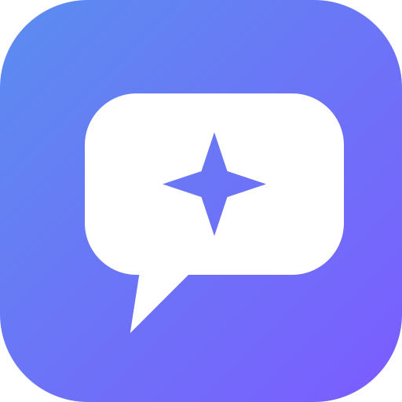
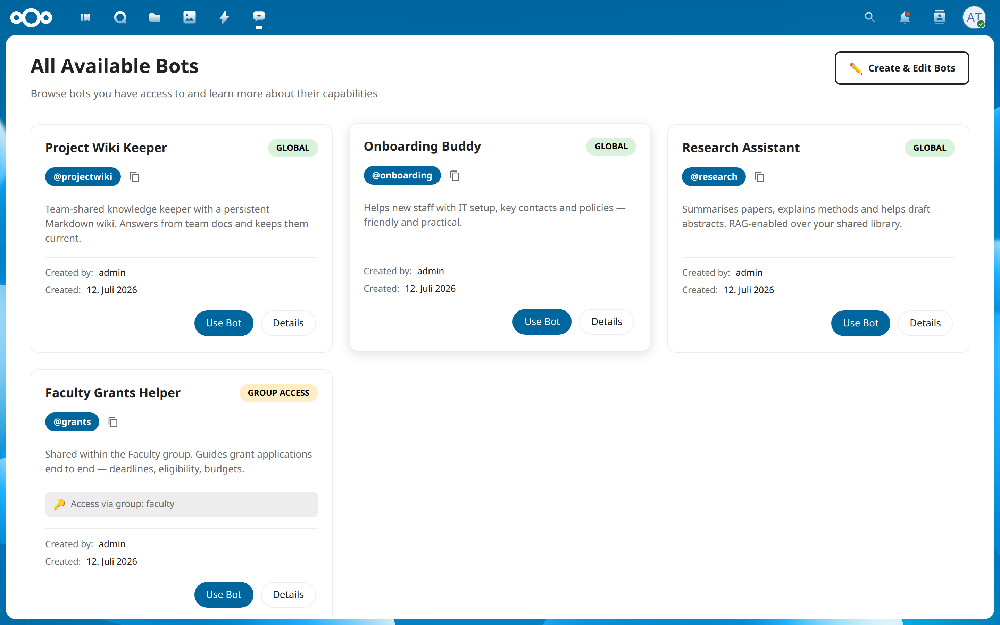
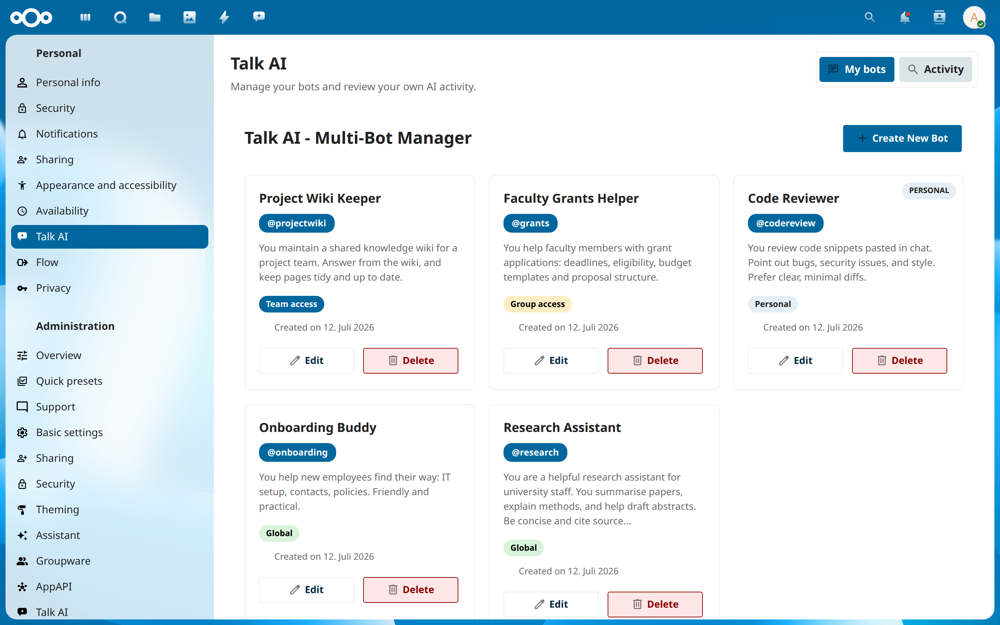
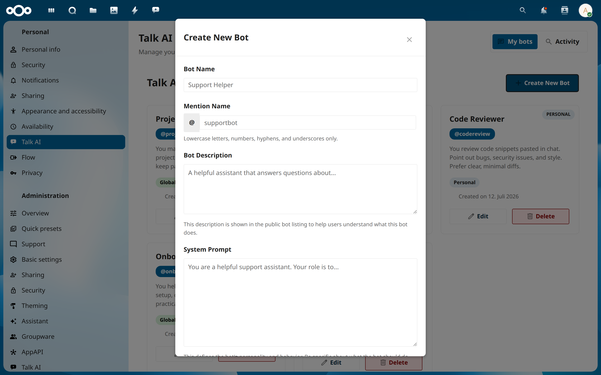
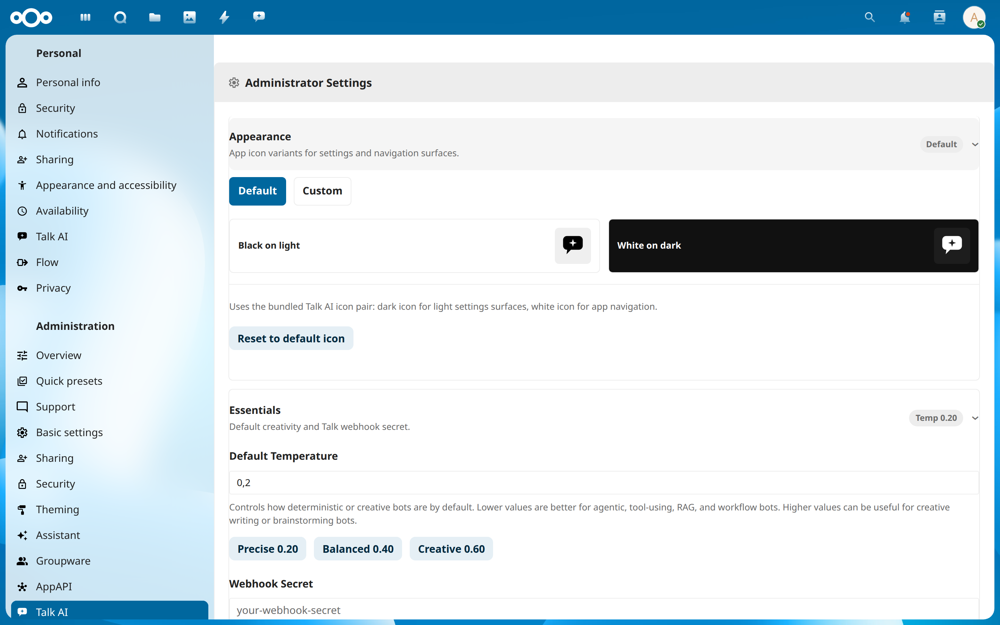

<div align="center">



# Talk AI

<a href="https://educalliance.eu"></a>

**Run many purpose-built AI assistants inside Nextcloud Talk — each with its own prompt, model, knowledge and tools, under real access governance.**

[](LICENSE)
[](https://nextcloud.com)
[](#model-providers)

</div>

Talk AI turns Nextcloud Talk into a home for **multiple** AI bots instead of one generic assistant. A bot can stay **personal**, be shared with a **group** or **team**, or go **global** after approval — so an institution can run a research helper, an onboarding buddy, a code reviewer and a faculty-only grants assistant side by side, each governed by who's allowed to use it.

It connects Talk messages, per-bot system prompts, any **OpenAI-compatible** model endpoint, file knowledge (RAG), and agentic tool calls (built-in + MCP) into one app-managed workflow — with admin control over providers, credentials, rate limits, fallback behaviour and tool access.

<div align="center">

</div>

## Highlights

- **Governance-first scoping.** Every bot has a visibility scope — *personal*, *group*, *team*, or *global* — with an approval workflow for shared bots. Users only see and use the bots they're entitled to.
- **Multi-bot by design.** Unlimited bots, each with a stable `@mention`, own system prompt, temperature, and model selection.
- **Bring your own model.** Any OpenAI-compatible chat / model-list / embedding / vision / speech endpoint. Primary + optional secondary endpoint, plus an automatic fallback model on eligible timeouts or connection failures.
- **Knowledge (RAG).** Index Nextcloud files and folders; optional Docling conversion for PDF, Office and image formats. Bots answer from your documents.
- **Agentic tools.** Built-in tools for document search, room-document search, image analysis, audio transcription and persistent Markdown wikis — plus an **extension point** so companion apps can contribute their own tools, and **MCP** servers admins approve and users assign per bot.
- **Native Talk integration.** Shared Talk bot, Smart Picker support, signature-verified webhooks.

## Screenshots

| Multi-bot manager (owner view) | Create a bot |
|---|---|
|  |  |

| Admin settings (providers, appearance) | Bot discovery (member view) |
|---|---|
|  |  |

## Quick Start

**1. Install** into a Nextcloud apps directory and build the frontend:

```bash
cd /path/to/nextcloud/apps-extra
git clone https://github.com/EDUCAlliance/talk-ai.git educai
cd educai
npm ci && npm run build
```

**2. Enable** the app:

```bash
sudo -u www-data php occ app:enable educai
```

> **Why `educai`?** The app's internal identifier is `educai` — Talk AI began as the AI assistant of the **EDUC** university alliance, and the id is kept stable so existing deployments upgrade seamlessly (the routes, database tables and `occ` commands all use it). "Talk AI" is the product name; `educai` is the package name underneath.

**3. Configure** under **Administration settings → Talk AI**:

- Primary API endpoint + API key (any OpenAI-compatible provider)
- A default model or an allowed model list (fetched from `/v1/models`)
- Webhook secret

**4. Register the Talk bot** (Talk AI attempts this automatically; if your environment blocks it, do it manually):

```bash
sudo -u www-data php occ talk:bot:install \
  -f webhook,response \
  "Talk AI" \
  "your-webhook-secret" \
  "https://your-nextcloud.example/index.php/apps/educai/webhook/talk"
```

Then create your first bot in the **Talk AI** app, mention it in any Talk conversation, and chat.

<a name="model-providers"></a>
## Model providers

Talk AI speaks the OpenAI HTTP API, so it works with OpenAI, Azure OpenAI, self-hosted vLLM/Ollama, and academic gateways alike. Configure a **primary** endpoint, an optional **secondary** endpoint, and one **fallback** model. Model IDs are endpoint-aware (`primary:<model>` / `secondary:<model>`); legacy unprefixed names resolve against the primary endpoint.

## Documentation

- [Feature guide](docs/FEATURES.md) · [Architecture](docs/ARCHITECTURE.md) · [Bot setup](docs/BOT_SETUP_GUIDE.md)
- [Quick start](docs/QUICK_START.md) · [Troubleshooting](docs/TROUBLESHOOTING.md) · [Development](docs/DEVELOPMENT.md)
- [RAG tool guide](docs/RAG_TOOL_GUIDE.md) · [RAG background jobs](docs/RAG_BACKGROUND_JOBS_GUIDE.md)
- [Tool-provider extension point](docs/TOOL_PROVIDERS.md) — how companion apps add their own bot tools

## Development

Requirements: Nextcloud 30–34 · PHP 8.1+ · Node.js 22 / npm 10.5+.

```bash
npm run build          # production build
npm run watch          # dev build, rebuild on change
npm run lint           # eslint
vendor/bin/phpunit --bootstrap tests/unit/bootstrap.php tests/unit
```

See [docs/DEVELOPMENT.md](docs/DEVELOPMENT.md) for local Nextcloud verification notes.

## About

Talk AI is developed **by [EDUC — the European Digital UniverCity](https://educalliance.eu)**, an alliance of European universities, where it runs as the alliance-wide Talk assistant (hence the `educai` package id). The app is fully generic: it works with any OpenAI-compatible endpoint on any Nextcloud 30–34 install.

Deployment-specific functionality (e.g. EDUC's course-catalogue search) lives in separate companion apps that plug into the [tool-provider extension point](docs/TOOL_PROVIDERS.md) — the core stays clean.

Contributions welcome. Licensed under **AGPL-3.0-or-later**.
